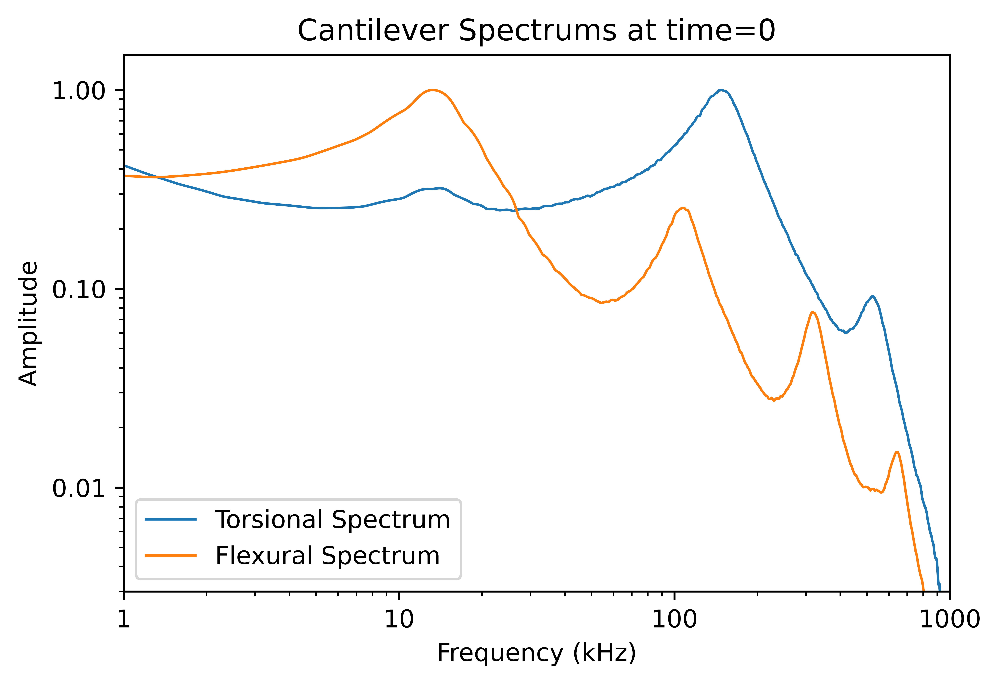
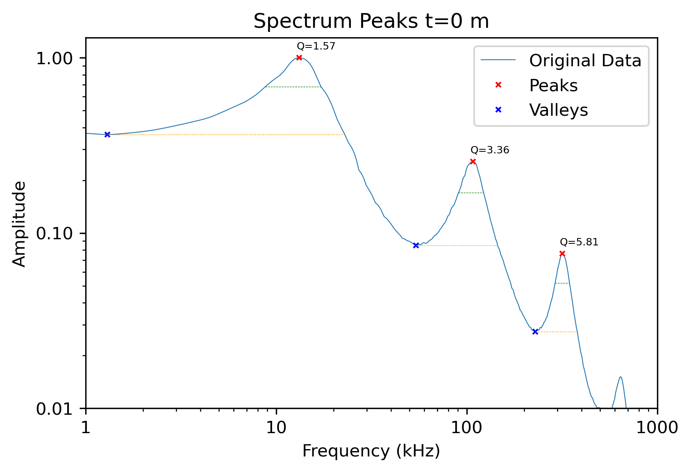
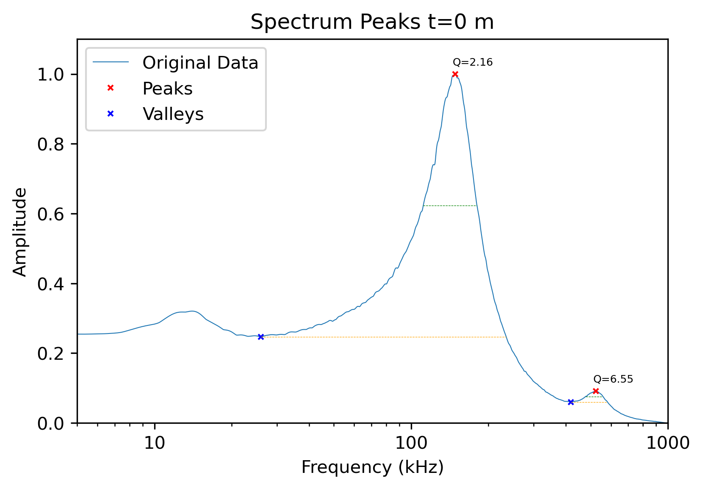
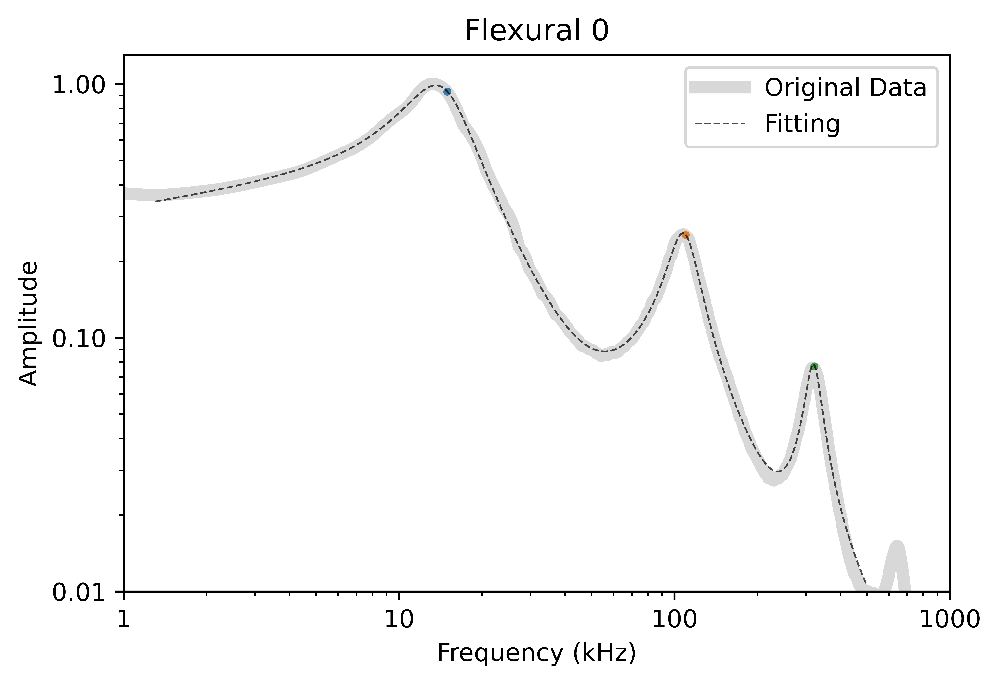
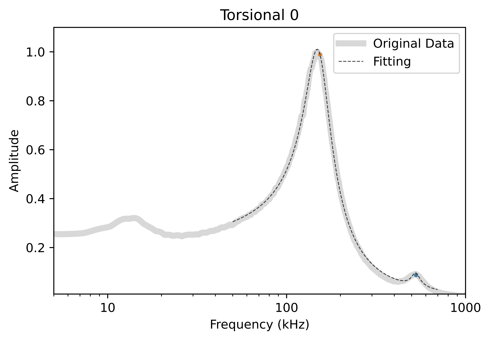
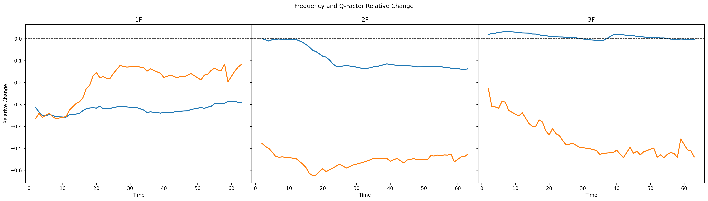
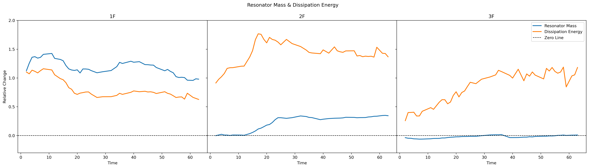

# Cell Resonance Analysis (w/ MTF)

## Introduction

This project delves into the analysis of cell resonances using an Atomic Force Microscope (AFM) in a liquid cell culture environment. The experiment involves measuring the vertical and lateral deflection of a cantilever immersed in cell culture liquid. Spectra are extracted through a Fourier transform applied to both the vertical and lateral deflection signals.

The experimental procedure encompasses acquiring spectra with the cantilever both without and with a cell attached to its tip. Initially, the spectrum is obtained without the cell, and then the cantilever is approached to the cell until attachment occurs. Subsequently, the spectrum is measured again under this condition.

The `conditioning.py` script, available in [this GitHub project](https://github.com/javier-rueda/Cell-Resonances/tree/main/data_analysis/conditioning), plays a pivotal role in processing the raw data obtained from LabView. This script ensures the data is formatted appropriately for the subsequent analysis.

In the fitting script presented here, we employ the Mass Transfer Function to model the resonance behavior of the cell-cantilever system. The Mass Transfer Function is utilized as a theoretical framework to fit our experimental data, enabling the extraction of mechanical and vibrational properties specific to the cell.

This documentation provides insights into the theoretical background, data structure, and the step-by-step procedures employed in the analysis. It serves as a comprehensive resource for understanding the application of the Mass Transfer Function in elucidating the mechanical properties of cells through AFM.


## Code Execution

### Loading and Preprocessing Data

The script begins by prompting the user to select the CSV file generated by the 'conditioning.py' script. The code runs the `browse_csv` function asking the user to select the data and proceeds with loading such data into a DataFrame for further analysis:

```data, filename = browse_csv("Please select 'conditioned' file: ")```

The DataFrame should have the following format:

<div style="margin:auto;">
  <table>
    <tr><th>frequencies</th><th>flexural_0</th><th>torsional_0</th><th>flexural_1</th><th>torsional_1</th><th>flexural_2</th><th>...</th></tr>
    <tr><td>1000.000000</td><td>0.370296</td><td>0.417381</td><td>0.294897</td><td>1.000000</td><td>0.309055</td><td>...</td></tr>
    <tr><td>1003.380271</td><td>0.370207</td><td>0.416716</td><td>0.296228</td><td>0.997549</td><td>0.311315</td><td>...</td></tr>
    <tr><td>1006.771967</td><td>0.370117</td><td>0.416049</td><td>0.297557</td><td>0.995095</td><td>0.313564</td><td>...</td></tr>
    <tr><td>...</td><td>...</td><td>...</td><td>...</td><td>...</td><td>...</td><td>...</td></tr>
    <tr><td>1000000.000000</td><td>0.369936</td><td>0.414710</td><td>0.300206</td><td>0.990190</td><td>0.318002</td><td>...</td></tr>
  </table>
</div>


The DataFrame exhibits a structured representation of experimental data, featuring a frequency column ranging from 1 kHz to 1 MHz. These frequency values are equidistantly spaced in a logarithmic scale, spanning 2048 points. 

The additional columns, labeled as `flexural_i` and `torsional_i`, provide spectra at distinct time points denoted by 'i' in minutes. Specifically, time point '0' corresponds to spectra obtained before cell attachment, offering insights into the dynamic behavior of the cantilever as it interacts with the cell over time.

Here is an example of how the cantilever spectrum looks like:
<div style="text-align:center">
  
</div>


### First Estimation of Resonance Frequency and Quality Factors

In this section, we embark on the initial estimation of resonance frequencies and quality factors for both flexural and torsional modes. 
The primary objective is to perform a preliminary estimation of resonance frequencies and quality factors. 
To achieve this, we employ the `peak_identification_flexural` and `peak_identification_torsional` functions, designed to identify prominent peaks and valleys in the flexural and torsional spectral data.

To initiate the estimation process, we utilize the `peak_identification_flexural` and `peak_identification_torsional` functions with the following lines of code:
```
peaksF, valleysF = peak_identification_flexural(y_flexural, x_frequencies)
peaksT, valleysT = peak_identification_torsional(y_torsional, x_frequencies)
```
The details concerning peaks and valleys within the spectral data are stored in two distinct DataFrames. 
For each identified peak we obtain the peak frequency, its amplitude, the Full Width at Half Maximum (FWHM), the total width of the peak, and the associated Quality Factor.

After the initial peak identification, one can visualize the outcomes of the detection process using the function: 

`plot_spectrum_peaks(x_data, y_data, peaks_df, valleys_df)`.
<div style="display: flex; justify-content: space-between;">
    
    
</div>

IMPORTANT: `peak_identification_torsional` needs to be improved!!

### Fitting to Simple Harmonic Oscillator with Hydrodynamic Factor.

This chapter explores the process of fitting the experimental data to a theoretical model based on a *Simple Harmonic Oscillator (SHO)* with the inclusion of a hydrodynamic factor $\lambda$. 

The SHO model is a fundamental representation of oscillatory systems, and the addition of the hydrodynamic factor accounts for fluid interactions, providing a more comprehensive analysis. The following sections detail the implementation of the fitting procedure, offering insights into the extraction of key parameters that contribute to the characterization of cell mechanics. To avoid repetition, we will be taking as an example the fitting of the flexural spectra.

Before initiating the fitting, a critical step involves selecting the appropriate range for the analysis. Interestingly, there is no discernable distinction between fitting the entire dataset at once or fitting each peak individually before consolidating the results. To define the fitting range, the following functions are utilized:

```
fitting_regions_F = regions_F(peaksF, valleysF)
xFit_flexural, yFitRange_flexural = range_fit(fitting_regions_F, x_frequencies, y_flexural,
                                              start_mode=1, end_mode=3, flat_i=5)
```

Here, we end up with the variables `xFit_flexural` and `yFitRange_flexural`, representing the values within the chosen range for the fitting process.


The function `initial_values_F` provides the capability to set or modify the initial values of the parameters used in the fitting process. Similarly, the function `bounds_SHO_F` facilitates the customization of bounds for each parameter in the fitting model. By adjusting these initial values and parameter bounds, users can influence the starting point of the fitting algorithm and guide it toward convergence.

```
initial_guess_F = initial_values_F(peaksF)
parameter_bounds_F = bounds_SHO_F(peaksF, 
                                  min_resFactor=0.9, max_resFactor=1.3, 
                                  min_QFactor=0.3, max_QFactor=10)
```


The data is then fitted to a theoretical model represented by the SHO with Hydrodynamic Factor function (eq. 2.4):

$$ 
F_{\lambda} = \sqrt{\sum_{n=1}^{N}  \frac{A^2_n  (\frac{\omega}{\omega_n})^{\lambda}}{(\omega^2/\omega_n^2)^{(1 + \lambda)}  + Q_n^2  (1-(\omega^2/\omega_n^2))^2} + \frac{P}{\omega} + W}  
$$

being $N$ the total number of vibrational modes of the spectrum. $P$ and $W$ are global fitting parameters.

The parameters $A_n, \omega_n, Q_n$, and $\lambda_n$ represent the amplitude, resonance frequency, quality factor, and the hydrodynamic parameter corresponding to the the $n$-th vibrational mode. 


The fitting process is initialized by defining parameters and using iterative refinement. The iterative fitting continues until the correlation coefficient $\(R^2\)$ reaches 0.999 or when the variation in the parameters is less than 1%. The final fitted values are then utilized to generate the fitting curve. 

```
# First Estimation of Fitting Parameters
params_F, covariance = curve_fit(SHO_hydro_full, xFit_flexural, yFitRange_flexural, method='trf',
                                 p0=initial_guess_F, bounds=parameter_bounds_F, maxfev=10000)

# Iterative Fitting
params_F, covariance = iterative_fitting(params_F, parameter_bounds_F, xFit_flexural, yFitRange_flexural, N=1000)

# Fitting Curve
yFit_flexural = SHO_hydro_full(xFit_flexural, *params_F)
```

After completing the spectral fitting process, the obtained results can be visualized using the function:

`plot_fitting(x_frequencies, y_flexural, xFit_flexural, yFit_flexural, params_F, title=f"Flexural {i}")`.

<div style="display: flex; justify-content: space-between;">
    
    
</div>

### Parameter Analysis (Hydrodynamic Fitting)

All parameters are then saved into the DataFrame `fitting_parameters_F[f'flexural_{i}']` for further analysis. One may opt to exclude outliers from the dataset using the `clean_dataframe(fitting_parameters_F)` function. However, caution is advised in the application of this function, as while it enhances the internal coherence of the data, there is a risk of excessive reduction, potentially leading to temporal gaps in the dataset.

After creating the fitting parameters dataset, we will transpose the DataFrame to better organize the information, assigning each column to a specific parameter. This restructuring is intended to improve the dataset's suitability for subsequent analytical procedures. 


Once the transposition is complete, we can determine the relative changes in both the Resonance Frequency and Quality Factor for each vibrational mode. All new information will be added to its corresponding DataFrame. This analysis can be performed using the function

```
parametersF = compute_relative_change(parametersF, columns=['Frequency 1F', 'QFactor 1F',
                                                            'Frequency 2F', 'QFactor 2F',
                                                            'Frequency 3F', 'QFactor 3F'])
```

The results can be visualized in a plot by running the function `plot_relative_change(parametersF, parametersT)`.

<div style="text-align:center">
  
</div>


In a similar fashion, after determining the relative change in Resonance Frequency and Quality Factor, one can employ Equation (1.64) to compute the relative change in resonator mass $\mu_n$. The variation in dissipation energy $\zeta_n$ attributed to internal cell dissipation subsequent to cell adhesion can be calculated from Equation (1.66).

$$ \mu_n = \left(\frac{\omega_{R,n}}{\omega_{RC,n}}\right)^2 -1 $$

$$\zeta_n = \frac{Q_{R,n}}{Q_{RC,n}}-\left(\frac{\omega_{RC,n}}{\omega_{R,n}}\right)^2$$

being $\omega_{R,n}$  $(Q_{R,n})$ the Resonance Frequency (the Quality Factor) of the $n$-th mode before cell adhesion, whereas $\omega_{RC,n}$  $(Q_{R,n})$ corresponds to the resonance frequency (the Quality Factor) of the cell-resonator system after the cell has adhered.  Similarly as has been done previously, one can plot the results by using the function `plot_resonator_dissipation(parametersF, parametersT)`.


<div style="text-align:center">
  
</div>

The DataFrames containing fitting parameters information can be exported to a CSV file for subsequent analysis or utilization in other scripts. This export operation is facilitated by the function `export_dataframe(parametersF, directory, filename)`.


| Time | Amplitude 1F | Frequency 1F | QFactor 1F | Lambda 1F | Amplitude 2F | Frequency 2F | QFactor 2F | Lambda 2F | Amplitude 3F | Frequency 3F | QFactor 3F | Lambda 3F | WN | Fcut | R2 | MSE | Frequency 1F RelativeChange | QFactor 1F RelativeChange | Frequency 2F RelativeChange | QFactor 2F RelativeChange | Frequency 3F RelativeChange | QFactor 3F RelativeChange | Resonator Mass 1F | Resonator Mass 2F | Resonator Mass 3F | Dissipation Energy 1F | Dissipation Energy 2F | Dissipation Energy 3F |
|------|--------------|---------------|------------|-----------|--------------|---------------|------------|-----------|--------------|---------------|------------|-----------|----|------|----|-----|-----------------------------|--------------------------|-----------------------------|--------------------------|-----------------------------|--------------------------|-------------------|-------------------|-------------------|-----------------------|-----------------------|-----------------------|
| 0,0  | 0.9324       | 14972.41      | 1.7484     | 0.3692    | 0.2540       | 109685.45     | 3.8759     | 0.5938    | 0.0771       | 321556.93     | 7.2948     | 0.9791    | 0.0| 0.9989| 7.7e-05| 0.0 | 0.0                         | 0.0                      | 0.0                         | 0.0                      | 0.0                         | 0.0                      | 0.0               | 0.0               | 0.0               | 0.0                   | 0.0                   | 0.0                   |
| 2,0  | 0.9000       | 10267.90      | 1.1110     | 0.4980    | 0.1448       | 109763.18     | 2.0243     | 0.6690    | 0.0349       | 327640.72     | 5.6257     | 1.0       | 0.0| 3.0223| 9.0e-18| 1.4154e-16 | 0.9934                   | 6.9e-04                  | -0.3142                    | -0.3646                 | 7.1e-16                    | 0.9987                   | -0.2288           | 0.9133            | 0.2585            | 0.3997                | 0.4012                | 0.4845                |
| 3,0  | 0.9000       | 9969.33       | 1.1535     | 0.4553    | 0.1395       | 109141.38     | 1.9708     | 0.4413    | 0.0343       | 329364.52     | 5.0349     | 1.0       | 0.0| 0.9987| 0.00014| 0.0 | -0.3342                   | -0.3403                  | -0.00496                   | -0.4915                 | 2.4e-02                    | -0.3098                  | 1.2555            | 0.0099            | 0.4011            | 0.4053                | 0.4554                | 0.4554                |
| 4,0  | 0.9000       | 9747.04       | 1.1213     | 0.4395    | 0.1388       | 108524.77     | 1.9369     | 0.4372    | 0.0348       | 329533.03     | 5.0261     | 1.0       | 0.0| 0.9982| 0.00019| 0.0 | -0.3489                   | -0.3586                  | -0.01058                   | -0.5003                 | 2.5e-02                    | -0.3100                  | 1.3596            | 0.0215            | 0.3997            | 0.4012                | 0.4211                | 0.4211                |
| ...  | ...          | ...           | ...        | ...       | ...          | ...           | ...        | ...       | ...          | ...           | ...        | ...       | ...| ...  | ...| ... | ...                         | ...                      | ...                         | ...                      | ...                         | ...                      | ...               | ...               | ...               | ...                   | ...                   | ...                   |


### Mass Transfer Function

Since the Hydro Fitting gives us a decent estimation of parameters such as the Resonance Frequency and Q-Factors of the system, we will be using such parameters as initial values for our MTF fitting.

We will create a function that gives us the ranges for the fitting.
Torisonal: 5kHz - primer minimo (valley)
Flexural: valley after 1F - 800kHz

$$
F = \sqrt{\sum_{n=1}^N  \frac{A^2_n \left(  \frac{\omega}{\omega_{R,n}} \right)^{\lambda_n}}{   \left( \frac{\omega}{\omega_{R,n}} \right)^{2(1+\lambda_n)}  + Q_{R,n}^2 \left(   1- \left( 1 + \frac{\Delta m_n}{m_{R,n}}   \xi_n MTF(\omega)   \right)   \left(\frac{\omega}{\omega_{R,n}}\right)^2      \right)^2   } + \frac{P}{\omega} + W   }
$$

$$
\mu_n = \frac{\Delta m_n}{m_{R,n}} \xi_n
$$

$$
MTF_{tors}(\omega) = \frac{\phi_{C,1F}^2}{1- e^{\frac{-i\pi \beta_{C,1F}}{2}}  \left(  \frac{\omega}{\omega_{C,1F}} \right)^{2 - \beta_{C,1F}}  } + (1 - \phi_{C,1F}^2)
$$


$$
MTF_{flex}(\omega) = \frac{\phi_{C,1E}^2}{1- e^{\frac{-i\pi \beta_{C,1E}}{2}}  \left(  \frac{\omega}{\omega_{C,1E}} \right)^{2 - \beta_{C,1E}}  } + 
\frac{1 - \phi_{C,1E}^2}{1- e^{\frac{-i\pi \beta_{C,1F}}{2}}  \left(  \frac{\omega}{\omega_{C,1F}} \right)^{2 - \beta_{C,1F}}  } 
$$


