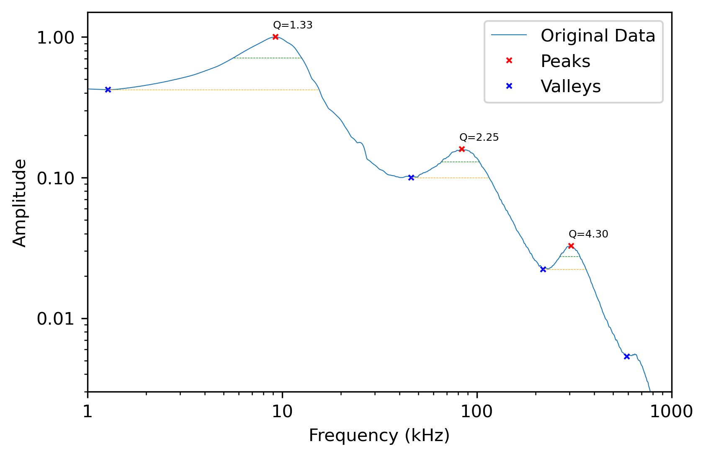

# Cell Resonance Analysis (w/ MTF)

## Introduction

This project delves into the analysis of cell resonances using an Atomic Force Microscope (AFM) in a liquid cell culture environment. The experiment involves measuring the vertical and lateral deflection of a cantilever immersed in cell culture liquid. Spectra are extracted through a Fourier transform applied to both the vertical and lateral deflection signals.

The experimental procedure encompasses acquiring spectra with the cantilever both without and with a cell attached to its tip. Initially, the spectrum is obtained without the cell, and then the cantilever is approached to the cell until attachment occurs. Subsequently, the spectrum is measured again under this condition.

The `conditioning.py` script, available in [this GitHub project](https://github.com/javier-rueda/Cell-Resonances/tree/main/data_analysis/conditioning), plays a pivotal role in processing the raw data obtained from LabView. This script ensures the data is formatted appropriately for the subsequent analysis.

In the fitting script presented here, we employ the Mass Transfer Function to model the resonance behavior of the cell-cantilever system. The Mass Transfer Function is utilized as a theoretical framework to fit our experimental data, enabling the extraction of mechanical and vibrational properties specific to the cell.

This documentation provides insights into the theoretical background, data structure, and the step-by-step procedures employed in the analysis. It serves as a comprehensive resource for understanding the application of the Mass Transfer Function in elucidating the mechanical properties of cells through AFM.


## Code Execution

### Loading and Preprocessing Data

The script begins by prompting the user to select the CSV file generated by the 'conditioning.py' script. The code runs the `browse_csv` function asking the user to select the data and proceeds with loading such data into a DataFrame for further analysis:

```data, filename = browse_csv("Please select 'conditioned' file: ")```

The DataFrame should have the following format:

| frequencies      | flexural_0 | torsional_0 | flexural_1 | torsional_1 | flexural_2 | ... |
| ---------------- | ---------- | ----------- | ---------- | ----------- | ---------- | --- |
| 1000.000000      | 0.370296   | 0.417381    | 0.294897   | 1.000000    | 0.309055   | ... |
| 1003.380271      | 0.370207   | 0.416716    | 0.296228   | 0.997549    | 0.311315   | ... |
| 1006.771967      | 0.370117   | 0.416049    | 0.297557   | 0.995095    | 0.313564   | ... |
| ...      | ...   | ...    | ...   | ...    | ...   | ... |
| 1000000.000000      | 0.369936   | 0.414710    | 0.300206   | 0.990190    | 0.318002   | ... |

The DataFrame exhibits a structured representation of experimental data, featuring a frequency column ranging from 1 kHz to 1 MHz. These frequency values are equidistantly spaced in a logarithmic scale, spanning 2048 points. 

The additional columns, labeled as `flexural_i` and `torsional_i`, provide spectra at distinct time points denoted by 'i' in minutes. Specifically, time point '0' corresponds to spectra obtained before cell attachment, offering insights into the dynamic behavior of the cantilever as it interacts with the cell over time.

Here is an example of how the cantilever spectrum looks like:
<div style="text-align:center">
  
</div>


### First Estimation of Resonance Frequency and Quality Factors

In this section, we embark on the initial estimation of resonance frequencies and quality factors for both flexural and torsional modes. 
The primary objective is to perform a preliminary estimation of resonance frequencies and quality factors. 
To achieve this, we employ the `peak_identification_flexural` and `peak_identification_torsional` functions, designed to identify prominent peaks and valleys in the flexural and torsional spectral data.

To initiate the estimation process, we utilize the `peak_identification_flexural` and `peak_identification_torsional` functions with the following lines of code:
```
peaksF, valleysF = peak_identification_flexural(y_flexural, x_frequencies)
peaksT, valleysT = peak_identification_torsional(y_torsional, x_frequencies)
```
The details concerning peaks and valleys within the spectral data are stored in two distinct DataFrames. 
For each identified peak we obtain the peak frequency, its amplitude, the Full Width at Half Maximum (FWHM), the total width of the peak, and the associated Quality Factor.

After the initial peak identification, one can visualize the outcomes of the detection process using the function: 

`plot_spectrum_peaks(x_data, y_data, peaks_df, valleys_df)`.
<div style="text-align:center">
  
</div>


