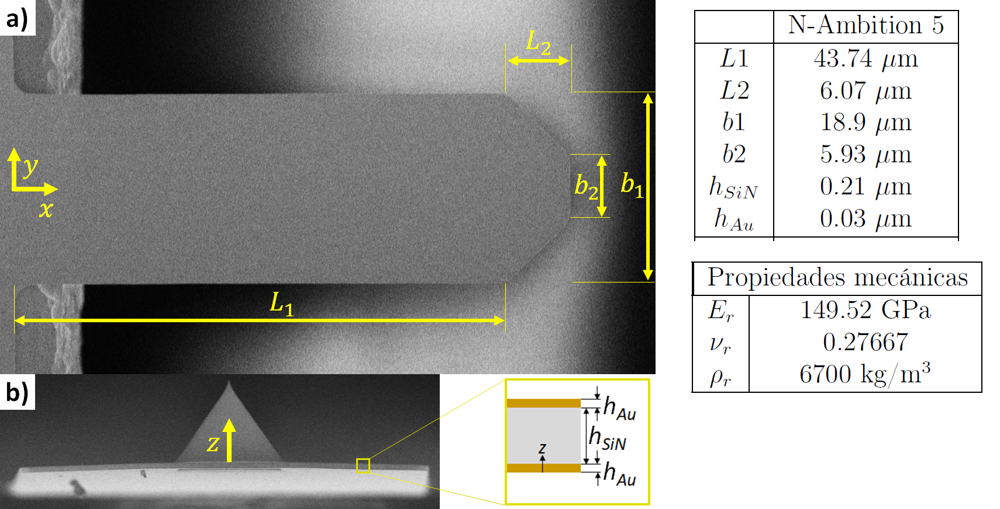

# Cantilever Information for *nAmbition-5* and *nAmbition-10*

## *nAmbition* Silicon Nitride Arrays

- **AFM Tip:** Silicon Nitride
    - **Radius:** < 10 nm
    - **Height:** 3.5 μm
- **AFM Cantilevers:** Silicon Nitride
- **AFM Support Chip:** Pyrex glass

## Cantilever Characteristics

### *nAmbition-5*
*Previously used by Veronica Puerto*

- **Shape of the Cantilevers:** Rectangular
- **Resonance Frequency:** 23 / 94 [kHz]
- **Force Constant:** 0.03 / 0.17 [N/m]
- **CB Length:** 100 / 50 [μm]
- **CB Width:** 30 / 20 [μm]
- **CB Thickness:** 0.24 [μm]
- **Number of Cantilevers:** 2 / 3 (1 without tip)
- **Pitch:** 200 [μm]
- **Coating:** 30 nm Au on both sides

### *nAmbition-10*

- **Shape of the Cantilevers:** Rectangular
- **Resonance Frequency:** 11 / 42 [kHz]
- **Force Constant:** 0.01 / 0.05 [N/m]
- **CB Length:** 144 / 75 [μm]
- **CB Width:** 30 / 20 [μm]
- **CB Thickness:** 0.24 [μm]
- **Number of Cantilevers:** 2 / 8 (1 without tip)
- **Pitch:** 100 [μm]
- **Coating:** 30 nm Au on both sides

### Shape and Mechanical Properties

